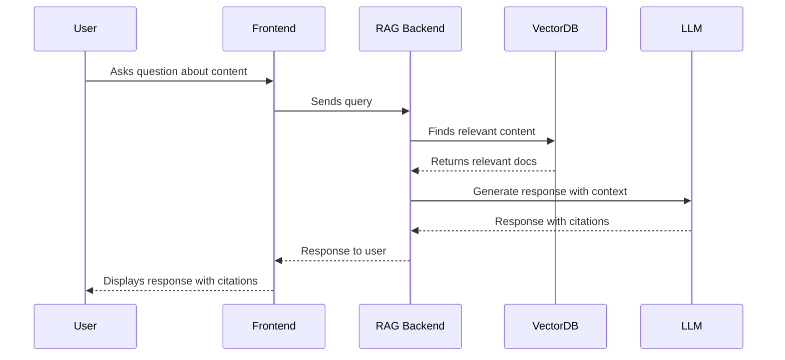

# Content Types and Rich Media

This chapter demonstrates the various content types that can be included in AI-driven books with RAG capabilities.

## Code Blocks

Docusaurus provides excellent support for code blocks with syntax highlighting:

```python
def rag_system_overview():
    """
    Demonstrates the basic components of a RAG system
    """
    # 1. Index content
    indexed_content = index_documents(book_content)
    
    # 2. Process user query
    query_embedding = encode_query(user_query)
    
    # 3. Retrieve relevant content
    relevant_docs = retrieve_similar(indexed_content, query_embedding)
    
    # 4. Generate response
    response = generate_answer(query, relevant_docs)
    
    return response
```

## Diagrams

Mermaid diagrams provide a way to visualize system architectures:



## Images

You can include images in your content:


> Note: This is a placeholder reference. In a real implementation, you would place actual images in the `book/static/img` directory.

## Mathematical Expressions

Using LaTeX syntax (with proper Docusaurus configuration):

$$ \text{Relevance Score} = \cos(\vec{q}, \vec{d}) = \frac{\vec{q} \cdot \vec{d}}{|\vec{q}| |\vec{d}|} $$

## Interactive Elements

Docusaurus supports admonitions for special notes:

:::info
This is an information box highlighting important concepts.
:::

:::tip
This is a tip box with helpful hints.
:::

:::caution
This is a caution box warning about potential issues.
:::

## Practice Questions

1. How does Docusaurus handle code syntax highlighting?
2. What format does Docusaurus use for diagrams?
3. How can you include mathematical expressions in your content?

## Summary

This chapter demonstrated various rich content types that can be included in AI-driven books:
- Code blocks with syntax highlighting
- Mermaid diagrams for visualizations
- Images for illustration
- Mathematical expressions
- Admonitions for special notes

These content types, when properly indexed, can all be referenced by the RAG system when answering user queries.