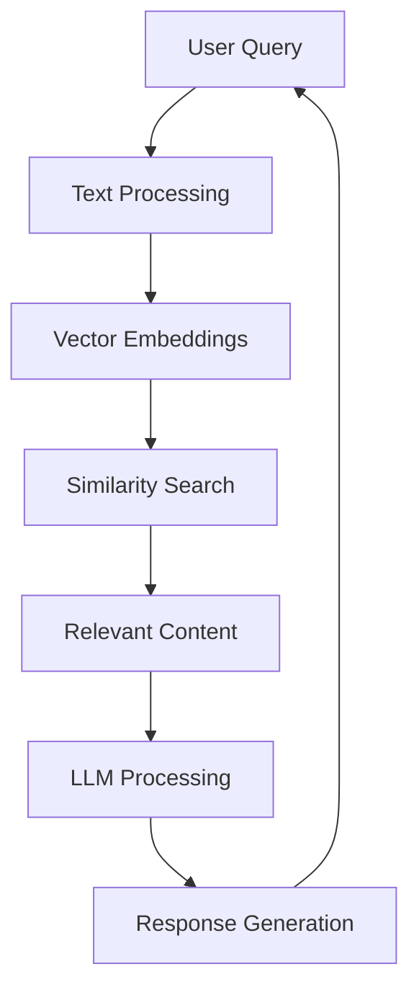

# RAG Implementation in Educational Systems

In this chapter, we'll explore the technical aspects of implementing RAG (Retrieval Augmented Generation) systems in educational contexts, focusing on the architecture and components that make AI-driven books possible.

## Architecture Overview

The RAG system consists of several key components that work together to provide intelligent responses based on educational content:



## The Three-Step Process

### 1. Indexing Phase

During the indexing phase, educational content is processed and stored in a vector database:

```python
# Example: Content indexing
def index_content(content: str, content_id: str) -> bool:
    # Generate embeddings from content
    embedding = generate_embedding(content)
    
    # Store in vector database with metadata
    store_in_vector_db(embedding, content_id, content)
    
    return True
```

### 2. Retrieval Phase

When a user submits a query, the system retrieves relevant content:

```python
# Example: Content retrieval
def retrieve_relevant_content(query: str) -> List[Document]:
    # Convert query to embedding
    query_embedding = generate_embedding(query)
    
    # Find similar documents
    similar_docs = search_vector_db(query_embedding)
    
    return similar_docs
```

### 3. Generation Phase

The final response is generated by combining the query with retrieved content:

```js
// Example: Client-side integration
async function askQuestion(query, selectedText = null) {
  const response = await fetch('/api/chat', {
    method: 'POST',
    headers: {
      'Content-Type': 'application/json'
    },
    body: JSON.stringify({
      query: query,
      selectedText: selectedText,
      sessionId: getCurrentSessionId()
    })
  });
  
  return response.json();
}
```

## Practice Questions

Now that you understand the basics of RAG implementation, try to answer these practice questions:

1. **What is the purpose of vector embeddings in a RAG system?**

   a) To compress the content for faster loading
   b) To represent text in a way that enables semantic similarity comparison
   c) To encrypt the content for security
   d) To format the text for display

2. **Which component is responsible for generating responses in a RAG system?**

   a) Vector database
   b) Large Language Model (LLM)
   c) Frontend application
   d) Content management system

3. **In the context of this book, what does "semantic search" mean?**
   
   a) A search that looks for exact keyword matches
   b) A search that understands the meaning and context of queries
   c) A search that only works with documents
   d) A search that uses regular expressions

## Hands-On Exercise

Consider this scenario: You want to implement a RAG system for a technical manual with 1000 pages. How would you approach the indexing phase to ensure optimal performance and accuracy?

Think about:
- How large chunks should you create from the content
- What metadata you would store with each chunk
- How you would handle updates to the manual

:::tip
Remember that chunk size affects both retrieval accuracy and processing speed. Smaller chunks provide more precise matches but require more storage and computation. Larger chunks are more efficient but might be too general.
:::

## Summary

In this chapter, we've covered:

- The overall architecture of RAG systems in education
- The three-step process: indexing, retrieval, and generation
- How to implement each component with code examples
- Practice questions to test your understanding

The next chapter will dive deeper into the implementation of vector search and how to optimize your content for better retrieval.